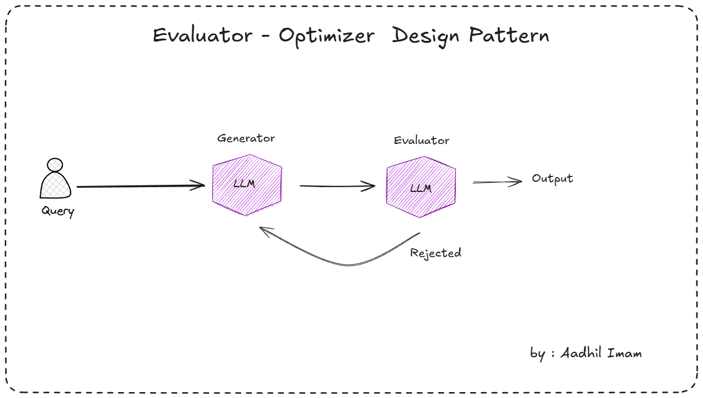

# Evaluator-Optimizer Agentic Workflow Design Pattern

The **Evaluator-Optimizer** agentic workflow design pattern (also known as Generator-Critic or Self-Refine) is a powerful architecture for building iterative AI systems, especially those powered by large language models (LLMs). It drives continuous improvement of outputs through a structured feedback loop between generation and critical assessment.

## Core Components

- **Optimizer** (Generator / Proposer)  
  Acts as the creative force. It generates initial outputs or solutions and refines them based on feedback received from the evaluator.

- **Evaluator** (Critic / Assessor)  
  Acts as the quality gatekeeper. It reviews the optimizer's output against predefined criteria (e.g., accuracy, completeness, style, logical consistency), provides structured feedback, scores, or a pass/fail decision.

## How It Works

1. **Task Input**  
   The system receives a task that benefits from high-quality, refined output (e.g., "Write a detailed technical report" or "Solve this complex reasoning problem").

2. **Initial Generation**  
   The optimizer creates a first draft or proposed solution.

3. **Evaluation**  
   The evaluator analyzes the output, identifying errors, gaps, or improvements and generating constructive feedback.

4. **Refinement**  
   The optimizer incorporates the feedback to produce an improved version.

5. **Iteration & Synthesis**  
   The process loops until the evaluator approves the output, a maximum iteration count is reached, or another stopping criterion is met. The final refined output is returned.

This pattern forms a simple yet effective self-improvement loop, often implemented with alternating LLM calls or specialized agent roles.

## Advantages

- **Superior Output Quality** – Iterative critique and revision consistently produce better results than single-shot generation.
- **Error Detection & Correction** – Effectively reduces hallucinations, inconsistencies, and logical flaws.
- **Flexibility** – Easily adapted to various criteria (objective metrics, rubrics, or subjective standards).
- **Simplicity & Efficiency** – Requires only two roles, making it lightweight compared to larger multi-agent systems.
- **Robustness** – Naturally handles tasks where initial outputs are imperfect but improvable through feedback.

## Common Use Cases

- **Content Generation** – Drafting articles, emails, marketing copy, or creative writing with multiple revision rounds.
- **Code Development** – Generating code, evaluating for bugs/correctness, and iteratively debugging.
- **Reasoning & Problem Solving** – Tackling math problems, puzzles, or multi-step planning with verification.
- **Report & Summary Creation** – Producing research summaries, business analyses, or technical documentation with accuracy checks.
- **Creative Refinement** – Iteratively improving stories, designs, or ideas based on coherence and impact critiques.